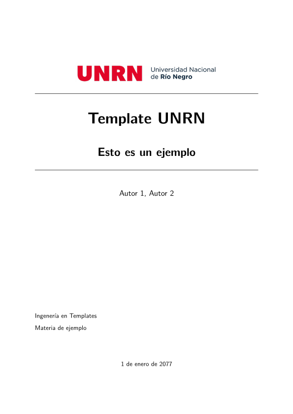
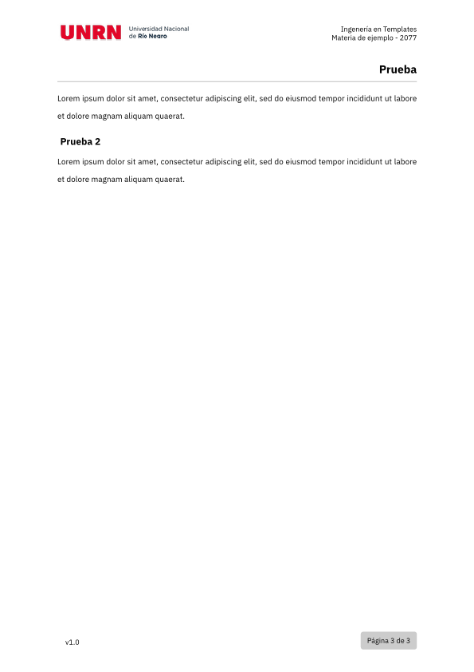

UNRN Template
=============
Template Typst para la Universidad Nacional de Río Negro (UNRN).

## Dependencias
- `typst`
- `just`
- `pandoc >= 3.1.2` (opcional)

## Instalación

Solo hace falta correr:
~~~sh
just
~~~

## Uso

### Con `typst`
Se puede usar el siguiente código como base:

~~~typst
#import "@local/unrn-template:1.0.0": classic 

#show: classic.with(
  title: "Template UNRN",
  subtitle: "Esto es un ejemplo",
  toc: true,
  font: "IBM Plex Sans",
  monofont: "IBM Plex Mono",
  cover: true,
  authors: ("Autor 1", "Autor 2",),
  subject: "Materia de ejemplo",
  career: "Ingenería en Templates",
  year: "2077",
  date: "1 de enero de 2077",
  version: "v1.0"
)

= Prueba

#lorem(20)

== Prueba 2

#lorem(20)
~~~

Para ver el ejemplo se puede compilar con:

~~~sh
just build-example
~~~

Esto genera una carpeta `build/` con `example.pdf`

### Con `pandoc` 

~~~markdown
---
 title: "Template UNRN"
 subtitle: "Esto es un ejemplo"
 toc: true
 font: "IBM Plex Sans"
 monofont: "IBM Plex Mono"
 cover: true
 author: 
    - name: "Autor 1"
    - name: "Autor 2"
 subject: "Materia de ejemplo"
 career: "Ingenería en Templates"
 year: "2077"
 date: "1 de enero de 2077"
 version: "v1.0"
---

# Prueba

Lorem ipsum dolor sit amet, consectetur adipiscing elit, sed do eiusmod tempor incididunt ut labore et dolore magna aliqua.

## Prueba 2

Lorem ipsum dolor sit amet, consectetur adipiscing elit, sed do eiusmod tempor incididunt ut labore et dolore magna aliqua.
~~~

#### Compilar con `pandoc`

Para ver el ejemplo se puede compilar con:

~~~sh
just build-md-example
~~~

Para transformar de markdown a pdf con este template se puede utilizar el siguiente comando:

~~~sh
pandoc foo.md --wrap=none -pdf-engine=typst template=unrn.typ -o foo.pdf
~~~

## Ejemplos

