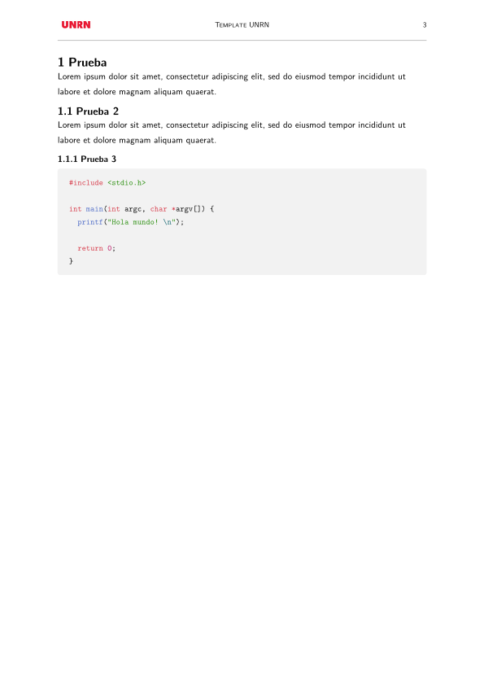

UNRN Template
=============
Template Typst para la Universidad Nacional de Río Negro (UNRN).

## Dependencias
- `typst`
- `just`

## Instalación

Solo hace falta correr:
~~~sh
just
~~~

## Uso
Se puede usar el siguiente código como base:

~~~typst
#import "@local/unrn-template:1.0.0": proyecto 

#show: proyecto.with(
  titulo: "Template UNRN",
  subtitulo: "Esto es un ejemplo",
  indice: true,
  fuente: "IBM Plex Sans",
  fuente_mono: "IBM Plex Mono",
  caratula: true,
  autores: ("Autor 1", "Autor 2",),
  materia: "Materia de ejemplo",
  carrera: "Ingenería en Templates",
  año: "2077",
  fecha: "1 de enero de 2077",
  version: "v1.0"
)

= Prueba
Hola mundo!
~~~

## Ejemplos

Para ver el ejemplo se puede compilar con:

~~~sh
just build-example
~~~

Esto genera una carpeta `build/` con `example.pdf`

